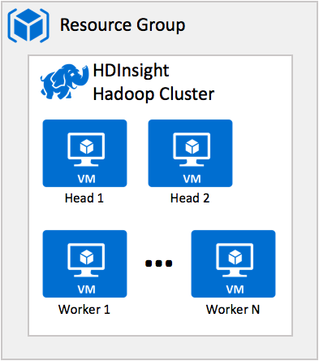
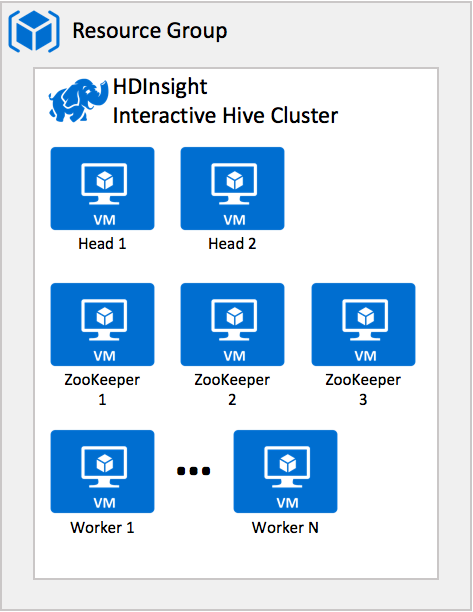
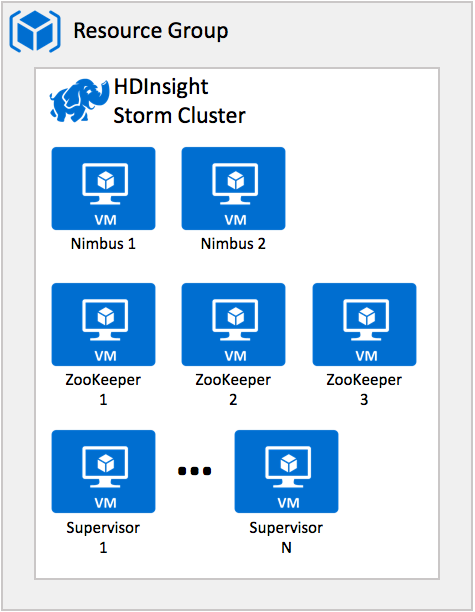
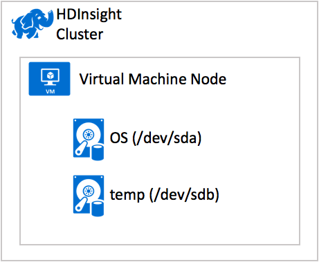
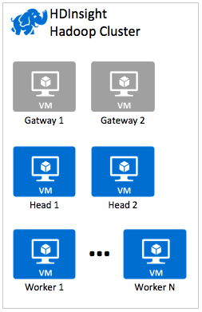
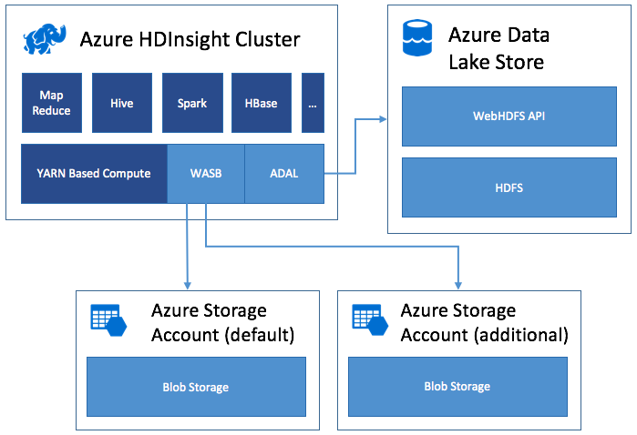
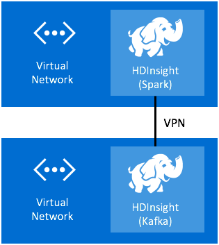
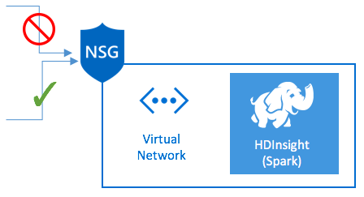

# HDInsight Architecture

An HDInsight cluster consists of several linux Azure Virtual Machines (nodes) that are used for distributed processing of tasks. Azure HDInsight handles implementation details of installation and configuration of individual nodes, so you only have to provide general configuration information. An HDInsight cluster is deloyed by first selecting a cluster type, which determines what components are installed and the specific topology of virtual machines that is deployed.

This article describes all of the available cluster types, their consituent nodes, the services the nodes run, as well the network and data storage architectures.

##  Cluster types
Azure HDInsight currently provides the following cluster types, each with a set of components that provide certain functionalities. 

> [!IMPORTANT]
> HDInsight clusters are available in various types, each for a single workload or technology. There is no supported method to create a cluster that combines multiple types, such as Storm and HBase on one cluster. If your solution requires technologies that are spread across multiple HDInsight cluster types, an [Azure virtual network](https://docs.microsoft.com/azure/virtual-network) can connect the required cluster types. 
>
>

| Cluster type | Functionality |
| --- | --- |
| [Hadoop](hdinsight-hadoop-introduction.md) |Uses HDFS, YARN resource management, and a simple MapReduce programming model to process and analyze data in parallel. Clusters of this type can also be [domain-joined](hdinsight-domain-joined-introduction.md), providing enterprise-grade access control for Hive workloads. |
| [HBase](hdinsight-hbase-overview.md) |A NoSQL database built on Hadoop that provides random access and strong consistency for large amounts of unstructured and semi-structured data - potentially billions of rows times millions of columns. See [What is HBase on HDInsight?](hdinsight-hbase-overview.md) |
| [Storm](hdinsight-storm-overview.md) |A distributed, real-time computation system for processing large streams of data quickly. See [Analyze real-time sensor data using Storm and Hadoop](hdinsight-storm-sensor-data-analysis.md). |
| [Spark](hdinsight-apache-spark-overview.md) |A parallel processing framework that supports in-memory processing to boost the performance of big-data analytics applications. Spark supports both imperative and SQL based querying, processing of streaming data, and performing machine learning at scale. See [What is Apache Spark in HDInsight?](hdinsight-apache-spark-overview.md) |
| [Kafka (Preview)](hdinsight-apache-kafka-introduction.md) | A distributed streaming platform that can be used to build real-time streaming data pipelines and applications. Kafka also provides message-queue functionality that allows you to publish and subscribe to data streams. See [Introduction to Apache Kafka on HDInsight](hdinsight-apache-kafka-introduction.md).|
| [R Server](hdinsight-hadoop-r-server-overview.md) |A server for hosting and managing parallel, distributed R processes for performing machine learning at scale, leveraging the capabilities of the HDInsight cluster. See [Overview of R Server on HDInsight](hdinsight-hadoop-r-server-overview.md). |
| [Interactive Hive (Preview)](hdinsight-hadoop-use-interactive-hive.md) |In-memory caching for interactive and faster Hive queries, leveraging Live Long and Process (LLAP) technology. See [Use Interactive Hive in HDInsight](hdinsight-hadoop-use-interactive-hive.md). |

### Node types
Each cluster type may contain different types of nodes that have a specific purpose in the cluster. The following table summarizes these node types.
| Type | Description | 
| --- | --- |
| Head node |  For the Hadoop, Interactive Hive, Kafka, Spark, HBase and R Server cluster types, the head nodes hosts the processes that manage execution of the distributed application. In addition, for the Hadoop, Interactive Hive, Kafka, Spark, and HBase cluster types the head node represents the node you can SSH into and execute applications that are then coordinated to run across the cluster resources. The number of head nodes is fixed at two for all cluster types. |
| Nimbus node | For the Storm cluster type, the Nimbus node provides functionality similar to the Head node. The Nimbus node assigns tasks to other nodes in a cluster through Zookeeper- it coordinates the running of Storm topologies.
| ZooKeeper node | Represents the nodes hosting the ZooKeeper process and data, which is used to coordinate tasks between the nodes performing the processing, leader election of the head node, and for keeping track of on which head node a master service is active on. The number of ZooKeeper nodes is fixed at two for all cluster types having ZooKeeper nodes.
| R Server Edge node | The R Server Edge node represents the node you can SSH into and execute applications that are then coordinated to run across the cluster resources. An edge node itself does not actively participate in data analysis within the cluster. In addition, this node hosts R Studio Server, enabling you to run R application using a browser.
| Worker node | Represents the nodes that support data processing functionality. Worker nodes can be added or removed from the cluster to increase or decrease computing capability and to manage costs.
| Region node | For the HBase cluster type, the region node (also referred to as a Data Node) runs the Region Server that is responsible for serving and managing a portion of the data managed by HBase. Region nodes can be added or removed from the cluster to increase or decrease computing capability and to manage costs.|
| Supervisor node | For the Storm cluster type, the supervisor node executes the instructions provided by the Nimbus node to peforming the desired processing.

### Nodes in an HDInsight cluster
Each cluster type has its own number of nodes, terminology for nodes, and default VM size. In the following table, the number of nodes for each node type is in parentheses. The scale-out capabilities (e.g., adding VM nodes to increase processing capabilities) for each cluster type are indicated in the node count as (1+) and in the diagram as Worker 1...Worker N. 

| Type | Nodes | Diagram |
| --- | --- | --- |
| Hadoop |Head nodes (2), Worker nodes (1+) | |
| Interactive Hive |Head nodes (2), ZooKeeper nodes (3), Worker nodes (1+) | |
| Kafka |Head nodes (2), ZooKeeper nodes (3), Worker nodes (1+) | |
| Spark |Head nodes (2), Worker nodes (1+) | |
| Storm |Nimbus node (2), ZooKeeper nodes (3), Supervisor nodes (1+) | |
| HBase |Head server (2), ZooKeeper node (3), Region server (1+) | |
| Microsoft R Server |Head nodes (2), ZooKeeper nodes (3), R Server Edge node (1), Worker nodes (1+) | |

## ZooKeeper
<a  target="_blank" href="http://zookeeper.apache.org/">Apache ZooKeeper</a> provides services that are core to the operation of a  cluster: a distributed configuration service, a synchronization service and a naming registry for distributed services. Many of the HDInsight cluster types rely on ZooKeeper for the coordination of processes in the cluster, the sharing of configuration and for coordinating the election of the primary head node.

ZooKeeper coordinates processes in large distributed systems using a shared hierarchical namespace of data registers known as znodes. The hierarchical structure is similar to a filesystem consisting of folders and files. Correspondingly, each znode is identified by a path, where the root is "/" and path elements are further separeated by a slash (such as /myapplication/settings).  Znodes contain small amounts of metadata needed to coordinate processes: status, location, configuration, and so on. 

Clients, typically processes running in the Head and Worker nodes of the HDInsight cluster, establish bi-directional TCP connections with ZooKeeper and get high-throughput, high availability and low latency access to the data it manages. ZooKeeper is designed to be fast for read heavy workloads, such as might be expected when nodes in the cluster are retrieving settings or are looking up the name of a service. 

ZooKeeper replicates it data in HDInsight over three nodes to ensure there is no single point of failure. The data managed by ZooKeeper is maintained in an in-memory database where updates are logged to disk for recoverability, and writes are serialized to disk before they are applied. Clients can connect to any of the ZooKeeper nodes and are guaranteed to see the same view of the data regardless of the node to which they connect. 

##  Node Virtual Machines 
The Azure Virtual Machines that support each node of an HDInsight cluster are managed by the HDInsight service. This means they are not typically accessed individually (the common exceptions being the Head and Edge nodes that you can access via SSH), and that when enumerating the resources used in your Azure subscription you will see only one resource for the HDInsight cluster, not one resource for each virtual machine within that cluster. 

Each virtual machine runs linux with the applicable components from the selected cluster type installed. The amount of RAM and quantity of CPU's are determined by the selected virtual machine size. 

A Linux Virtual Machine in Azure, including those used in an HDInsight cluster, has two disks associated with it. The disk at /dev/sda is your OS disk, /dev/sdb is your temporary disk. The OS disk (/dev/sda) contains the operating system and is optimized for fast VM boot time and does not provide good performance for your workloads. While the OS disk is backed by durable storage, as node VM's are managed by HDInsight, the VHD file backing the OS disk is not accessible to you (nor is the Storage Account which contains it). 

The temporary disk (/dev/sdb) is not durable, and can be lost if specific events like VM resizing, redeployment, or maintenance forces a restart of your VM. The temporary drive itself is backed by local HDD disk-based storage or SSD based storage depending on the VM type selected. However, as this temporary storage drive is present on the physical machine which is hosting your VM, it can have higher IOPs and lower latency when compared to the persistent storage like a standard data disk. The size of your temporary disk is related to the VM size for the node type you chose at cluster deployment time. 

In addition to an OS disk and a temp disk, Azure Virtual Machines support data disks. A data disk is a VHD that's attached to a virtual machine to store application data, or other data you need to keep. In general, the VMs in an HDInsight cluster do not support the attachment of data disks, although there are some exceptions as show in the table.  

|Cluster Type| Disk configuration supported |
|---|---|
| Kafka | Kafka deployments require additional managed disks. Standard or Premium managed disks are supported. |
| All other cluster types    | Only OS and temporary disks. No additional disks supported. |

> [!NOTE]
> For more information on the nodes the virtual machine sizes available to them, see [Default node configuration and virtual machine sizes for clusters](hdinsight-component-versioning.md#default-node-configuration-and-virtual-machine-sizes-for-clusters) in "What are the Hadoop components and versions in HDInsight?"
>
>

## Gateway Nodes
In addition to the node type previously described, in every HDInsight cluster there are another two nodes that are invisibly supporting communication with the cluster. These are the Gateway nodes. The Gateway nodes provide load balanced HTTPS access to the cluster (such as when accessing Ambari), provide SSL support, handles cluster credential validation, and act as a reverse proxy to communicate with a subset of Hadoop services running on the cluster. 

If you are accessing your cluster via a URL of the form:

    https://<clustername>.azurehdinsight.net

Then you are communicating with the cluster through one of the Gateway nodes.

It is important to note that the Gateway nodes do not provide support for SSH access to the cluster, as that is accomplished thru direct access to the head nodes. 

##  Data Storage Architecture  
Given that you should not use the local virtual machine storage for your data, where should you store the data managed by your HDInsight cluster? 

### HDFS in the HDInsight cluster
The Hadoop Distributed File System (HDFS) is a file system that, along with YARN and MapReduce, is the core of Hadoop technology. Hadoop stores data using the HDFS, which spreads the data across multiple servers, and then runs chunks of the processing job on each server, letting big data sets be processed in parallel. 

Although an on-premises installation of Hadoop uses the HDFS for storage on the cluster, in Azure you should use external storage services, and not the local disk storage provided by the virtual machines in the cluster.

HDInsight follows a strong separation of compute and storage-- as such the recommendation is to store your data either in Azure Storage blobs and Azure Data Lake Store, or a combination of the two. Both provide an HDFS compatible file system that persists data even if the cluster is deleted.

The benefit of this approach is:

* The data is persistent, even after you delete your HDInsight cluster. This means it will also be available without any data transfer effort should you deploy a new cluster to perform additional processing.
* The costs for storing your data are predominalty driven by the volume of data stored and tranferred, which can be signficantly less than the costs for running a cluster.
* The data is available for multiple clusters to act upon. 

Hadoop supports a notion of the default file system. The default file system implies a default scheme and authority. It can also be used to resolve relative paths. During the HDInsight cluster creation process, you can specify a blob container in Azure Storage as the default file system, or with HDInsight 3.5 or later, you can select either Azure Storage or Azure Data Lake Store as the default file system. 

In addition to this default file system, you can add additional Azure Storage Accounts or Data Lake Store instances during the cluster creation process or after a cluster has been created. 

For instructions about adding additional storage accounts, see [HDInsight using Azure Storage](hdinsight-hadoop-use-blob-storage.md), and for details on using Data Lake Store see [HDInsight using Data Lake Store](hdinsight-hadoop-use-data-lake-store). 

###  Metadata Storage  

HDInsight supports the use of a custom metastore for Hive and Oozie. The Hive metastore persists the metadata which describes the mappings of Hive tables to their locations in HDFS and the schemas of those tables. The metastore is also used by Spark as it stores metadata for Hive tables created with Spark SQL.

By default, the metastore data is stored internally by the HDInsight cluster. However, you can configure the cluster to use an external Azure SQL Database instance instead by configuring a custom metastore. Custom metastores can only be configured during the cluster creation process.

Oozie uses a metastore to store details about current and completed worklflows. To increase performance when using Oozie, you can use SQL Database as a custom metastore. The metastore can also provide access to Oozie job data after you delete your cluster. 

By combining use of SQL Database as your metastore with Azure Storage or Data Lake Store for persisting your data, you ensure that you can re-create your cluster without first having to reload either the data or the metadata.

##  Network Architecture  
By default when you create an HDInsight cluster, the VM nodes within that cluster are configured to communicate with each other, but Internet access to any of the cluster nodes is restricted to just the Head or Edge nodes (and limited to SSH or HTTPS). There are scenarios that need a greater degree of access into the networking environment of the cluster nodes, for example:

* You need to directly access services on HDInsight that aren't exposed over the Internet. For example, you have consumers or producers that need to directly work with Kafka brokers or clients that need to use the HBase Java API.
* You need to connect on-premises services to HDInsight. For example, use Oozie to import or export data to from an on-premises SQL Server.
* You need to create solutions that involve multiple HDInsight clusters of different types. For example, you might want to use Spark or Storm clusters to analyze data stored in a Kafka cluster.
* You want to restrict access to HDInsight. For example, to prevent inbound traffic from the internet.

Greater control over the HDInsight networking environment is achieved by deploying your cluster into an Azure Virtual Network. An [Azure Virtual Network](https://azure.microsoft.com/documentation/services/virtual-network/) allows you to create a secure, persistent network containing the resources you need for your solution. Cloud resources that you want to connect with your HDInsight cluster, such as Virtual Machines and other instances of HDInsight can then be provisioned into the same Virtual Network.

You can create a [site-to-site](https://docs.microsoft.com/azure/vpn-gateway/vpn-gateway-howto-site-to-site-resource-manager-portal) or [point-to-site](https://docs.microsoft.com/azure/vpn-gateway/vpn-gateway-howto-point-to-site-resource-manager-portal) VPN connection to enable connectivity between resources in an on-premises network and your HDInsight cluster.

You can also connect two different Virtual Network instances by configuring a [VNET-to-VNET connection](https://docs.microsoft.com/azure/vpn-gateway/vpn-gateway-howto-vnet-vnet-resource-manager-portal). 

You can also secure the network perimeter by using Network Security Groups to restrict traffic based on protocol, source and destination. 

In addition to securing in-bound traffic by applying NSGs to subnet of the Virtual Network, you can also configure user-defined routes and control the flow of network traffic through a virtual firewall appliance by deploying your HDInsight cluster into a Virtual Network. 

For more details on using HDInsight within a Virtual Network, see [Use Virtual Network](hdinsight-extend-hadoop-virtual-network.md) 

## Next steps

* [Hadoop Components on HDInsight](hdinsight-component-versioning.md): Learn about the Hadoop ecosystem components and versions in Azure HDInsight, as well as the Standard and Premium service levels.  

