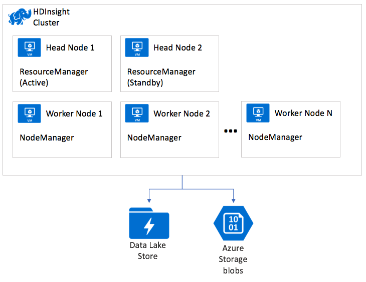

# Architecture of Hadoop on HDInsight
Hadoop includes two core components, the High Density File System (HDFS) which provides storage and Yet Another Resource Negotiator (YARN) which provides processing. With storage and processing capabilities a cluster becomes capable of running MapReduce programs that perform the desired data processing.

As described in [HDInsight Architecture](./hdinsight-architecture.md), HDFS is not typically deployed within the HDInsight cluster to provide storage. Instead, an HDFS compatible interface layer is exposed to Hadoop ecosystem components and the actual storage capability is provide by either Azure Storage or Data Lake Store. In the Hadoop case, MapReduce jobs executing on the HDInsight cluster run as if HDFS were actually present and require no changes to support their storage needs. This simplifies the discussion of the architecture of Hadoop on HDInsight, as storage is outsourced, but the processing which uses YARN remains a core component. This article introduces YARN and how it coordinates the execution of applications on HDInsight.

## YARN basics 
YARN is what governs and orchestrates data processing in Hadoop. It is structured as having two core services: the ResourceManager and the NodeManager. These two services run as processes on nodes in the cluster. 

### ResourceManager, NodeManager and ApplicationMaster
The ResourceManager grants cluster compute resources to applications like MapReduce jobs. It grants these resources in for the form of containers, which are themselves a way to describe an allocation of CPU cores and RAM memory. If you combined all the resources available in  cluster and then distributed it in blocks of a predefined number of cores and memory, each block of resources is a container. Each node in the cluster has a capacity for a certain number of containers and therefore the cluster has a fixed limit on the number of containers available. The allotment of resources in a container is configurable. 

When a MapReduce application needs to run on a cluster, it is the ResourceManager that provides it the containers in which to execute. The ResourceManager tracks the status of running applications, available cluster capacity and tracks applications as they complete and release the resources they utilized. 

The ResourceManager also runs a web server process that provides a web user interface you can access to monitor the status of applications. 

When an application is submitted to run on the cluster, it is submitted to the ResourceManager. In turn, the ResourceManager allocates a container on an available NodeManager nodes. The NodeManager nodes are where the application actually executes. In the first container allocated is run a special application called the ApplicationMaster. This ApplicationMaster is responsible for acquiring resources, in the form of subsequent containers, needed to run the submitted application. To do this, the ApplicationMaster examines the stages of the application (e.g, the map stage and reduce stage), factors in how much data needs to be processed and then requests the resources from the ResourceManager on behalf of the application (in a process called "negotiating"). The ResourceManager in turn grants resources from the NodeManagers in the cluster to the ApplicationMaster for it to use in executing the application. 

These NodeManagers run the tasks that make up the application and report their progress and status back to ApplicationMaster. The ApplicationMaster, in turn reports the status of the application and returns any results to the client.

## YARN on HDInsight
All HDInsight cluster types deploy YARN. The ResourceManger is deployed in a high-availability fashion having a primary and secondary instance, which run on the first and second head nodes within the cluster respectively. Only the one instance of the ResourceManager is active at a time. The NodeManager instances run across the available Worker Nodes in the cluster.

 

## Next steps
This article provided an architectural overview of Hadoop on HDInsight. 

* To further explore the architecture of HDInsight, see [HDInsight Architecture](./hdinsight-architecture.md).
* For further details on MapReduce, see [What is MapReduce](https://docs.microsoft.com/azure/hdinsight/hdinsight-use-mapreduce#a-idwhatisawhat-is-mapreduce).
* To run a sample MapReduce application on HDInsight, see [Use MapReduce with Hadoop and HDInsight with SSH](https://docs.microsoft.com/azure/hdinsight/hdinsight-hadoop-use-mapreduce-ssh).

