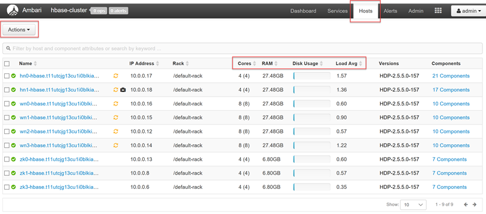
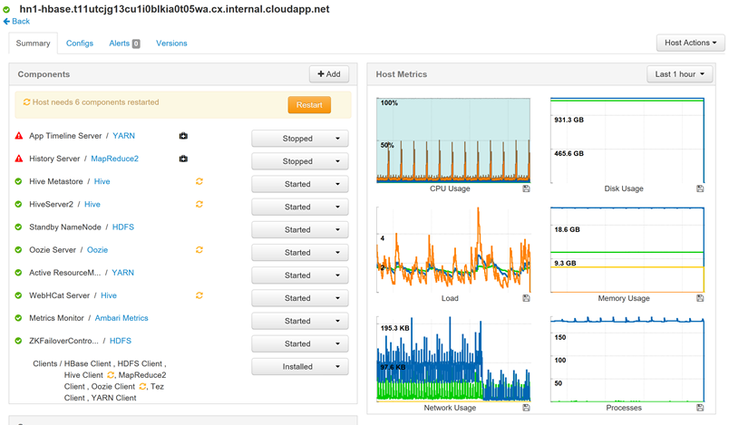

# Key Scenarios to Monitor

## Overview

Monitoring the health of your HDInsight cluster, from resource utilization, to storage bottlenecks, to whether your jobs are successfully running, is an important process for organizations of any size. Even when your code is well-written and works well under the most stringent testing conditions, issues may surface only when that code is executed under production-scale loads or when working with real world data. Other factors could be introduced, such as human error; someone executed the wrong command or made an incorrect configuration change.

How much effort you put into making cluster monitoring a routine practice depends on how much downtime you can afford, or whether the time to execute tasks is important to you. Outages or degraded performance can be very costly to organizations, in the form of revenue loss or not meeting SLAs, or any number of consequences that can have a negative impact on your business.

This article will go over some of the key scenarios to consider monitoring, linking to more information about steps to conduct the monitoring, where appropriate.

## Is the cluster well utilized, or under heavy/light load?

It is important for a Hadoop cluster to be well-balanced. This means ensuring that utilization is even across the nodes of your cluster. This means balancing the usage of RAM, CPU, and disk so that your processing tasks are not constrained by any one of these cluster resources.

To get a high-level look at the nodes of your cluster and their load, log in to the [Ambari Web UI](hdinsight-hadoop-manage-ambari), then select the **Hosts** tab. Your hosts are listed by their fully-qualified domain names. The Actions menu gives you options to perform actions on one or more of these hosts. Next to the host names are colored dots that indicates the operating status of each:

| Color | Description |
| -- | -- |
| Red | At least one master component on that host is down. Hover to see a tooltip that lists affected components. |
| Orange | At least one slave component on that host is down. Hover to see a tooltip that lists affected components. | 
| Yellow | Ambari Server has not received a heartbeat from that host for more than 3 minutes. |
| Green | Normal running state. |

You'll also see columns showing the number of cores and amount of RAM for each host. Plus, there are cores that show disk usage and the load average.

Click on any of the host names for a detailed look at components running on that host, as well as its metrics with a selectable timeline of CPU usage, load, disk usage, memory usage, network usage, and processes.

## Are the YARN queues properly configured?

As a distributed platform, Hadoop has various services running across the platform. These services need to be coordinated, cluster resources allocated, and access to a common data set needs to be managed. YARN (Yet Another Resource Negotiator) helps perform these tasks.

Read [Manage HDInsight clusters by using the Ambari Web UI](hdinsight-hadoop-manage-ambari) for details on setting alerts and viewing metrics.

## Is there any storage throttling happening?

There are times when your cluster's performance bottleneck happens at the storage level. These types of bottlenecks are most often due to blocking IOs (Input/Output operations), which happens when your running tasks sends more IO than the storage service can handle. This blocking causes a queue of IO requests waiting to be processed while other IOs are processed. In these cases, the blocks are due to throttling, which is not a physical limit, but a limit imposed by the storage service according to published SLAs. These limits ensure that no single client or tenant can use the service at the expense of others. The SLA in question is the number of IOPS (IO per second), which you can find [here](https://docs.microsoft.com/azure/storage/storage-scalability-targets) for Azure Storage.

If you are using Azure Storage, detailed information on monitoring storage-related issues, including throttling, can be found here:

* [Monitor, diagnose, and troubleshoot Microsoft Azure Storage](https://docs.microsoft.com/azure/storage/storage-monitoring-diagnosing-troubleshooting).

If your cluster's backing store is Azure Data Lake Store (ADLS), your throttling is most likely due to limits of bandwidth provided by ADLS. Throttling in this case could be identified by observing throttling errors in task logs.

For ADLS, view the throttling section for the appropriate service in the articles below:

* [Performance tuning guidance for Hive on HDInsight and Azure Data Lake Store](https://docs.microsoft.com/azure/data-lake-store/data-lake-store-performance-tuning-hive)
* [Performance tuning guidance for MapReduce on HDInsight and Azure Data Lake Store](https://docs.microsoft.com/azure/data-lake-store/data-lake-store-performance-tuning-mapreduce)
* [Performance tuning guidance for Storm on HDInsight and Azure Data Lake Store](https://docs.microsoft.com/azure/data-lake-store/data-lake-store-performance-tuning-storm)

## Next steps

This article introduced a few key scenarios to watch out for when monitoring your HDInsight cluster. Visit the links below to find out more about troubleshooting and monitoring your clusters:

* [Analyze HDInsight logs](hdinsight-debug-jobs)
* [Debug apps with YARN logs](hdinsight-hadoop-access-yarn-app-logs-linux)
* [Enable heap dumps for Hadoop services on Linux-based HDInsight](hdinsight-hadoop-collect-debug-heap-dump-linux)
