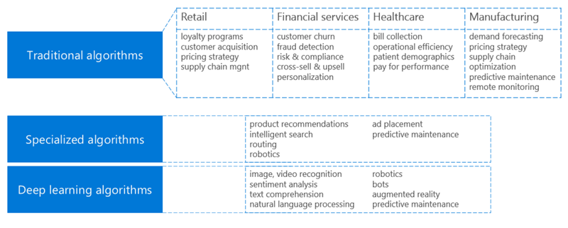
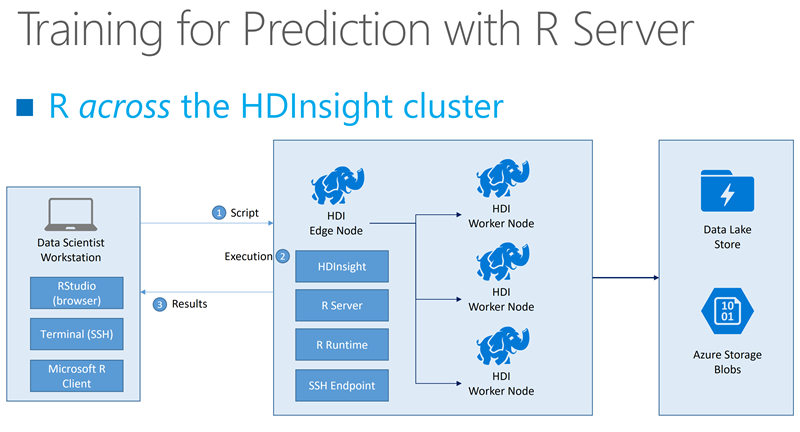
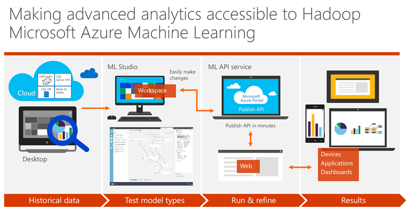

# Machine Learning Overview

HDInsight gives us the power to work with big data, providing the ability to obtain valuable insight from large (petabytes, or even exabytes) of structured, unstructured, and fast-moving data. How do we make sense of this influx of information? What sort of questions are we able to answer?

Some of the questions one might ask when analyzing big data are:

**Questions on social and web analytics:** What is my brand and product sentiment? How effective is my online campaign? Who am I reaching? How can I optimize or target the correct audience? 

**Questions that require connecting to live data feeds:** A large shipping company uses live weather feeds and traffic patterns to fine tune its ship and truck routes, leading to improved delivery times and cost savings. Retailers analyze sales, pricing and economic, demographic and live weather data to tailor product selections at particular stores and determine the timing of price markdowns.

**Questions that require advanced analytics:** Financial firms using machine learning to build better fraud detection algorithms that go beyond the simple business rules involving charge frequency and location to also include an individual’s customized buying patterns, ultimately leading to a better customer experience.

To help answer these questions, we can harness the power of machine learning. If you are unfamiliar with the term, the simplest way to describe machine learning is that it is a technique of data science that helps computers learn from existing data in order to forecast future behaviors, outcomes, and trends.

Here are some use cases of scalable machine learning;

## Analytics spectrum

Analytics can be thought of as being on a spectrum of increasing sophistication, consisting of four categories:

* **Descriptive** – What is happening?
    * *Example*: For a retail store, identify the customer segments for marketing purposes
* **Diagnostic** – Why did it happen?
    * *Example*: Understanding what factors are causing customers to leave a service (churn)
* **Predictive** – What will happen?
    * *Example*: Identify customers who are likely to upgrade to the latest phone
* **Prescriptive** – What should be done?
    * *Example*: What’s the best offer to give to a customer who is likely to want that latest phone

## The data science process

When you break it down to its essence, the learning process is the same for both humans and machines. We both require data input, using observation, memory, and recall to provide a factual basis for further reasoning. We then use abstraction by translating the data into broader representations. Finally, we generalize by using the abstraction to form a basis for action.

When employing machine learning, the typical data science process follows these five steps:

Once you've identified the business problem and have started collecting and processing your data, you need to create a model that represents your question or the outcome you wish to predict. The large bulk of your data should be used to train your model, with the smaller portion being used to test or evaluate it. The next step is to deploy, or operationalize, the model so that it can be used for supplying answers to our question. The last step is to monitor our model's performance and tune, if necessary. Part of this process can be periodically retraining our model with new data to try and increase its accuracy.

### Supervised or unsupervised learning?

Supervised and unsupervised learning refers to the requirements of the algorithm you want to use. If your algorithm needs to be trained on a set of data before it can provide conclusions, then it is considered a supervised algorithm, or learner. These need to be carefully trained before they can be shown other examples and provide good results.

Unsupervised algorithms, on the other hand, do not require training. They provide results, given the data at hand. The goal of unsupervised algorithms is to find relationships in the data. For instance, you might want to find groupings of customer demographics with similar buying habits.

## Common types of algorithms

| Algorithm | Use | Learning Type | Tools |
| --- | --- | --- | -- |
| Classification | Classify people or things into groups | Supervised | Decision trees, Logistic regression, neural networks |
| Clustering | Dividing a set of examples into homogenous groups | Unsupervised | K-means clustering |
| Pattern detection | Identify frequent associations in the data | Unsupervised | Association rules |
| Regression | Predict numerical outcomes | Supervised | Linear regression, neural networks |

## Machine learning on HDInsight

There are several machine learning options that run in HDInsight:

### SparkML and MLlib

[HDInsight Spark](https://docs.microsoft.com/azure/hdinsight/hdinsight-apache-spark-overview) is an Azure-hosted offering of [Spark](http://spark.apache.org/), a unified, open source, parallel data processing framework supporting in-memory processing to boost Big Data analytics. The Spark processing engine is built for speed, ease of use, and sophisticated analytics. Spark's in-memory distributed computation capabilities make it a good choice for the iterative algorithms used in machine learning and graph computations. There are two scalable machine learning libraries that bring the algorithmic modeling capabilities to this distributed environment: MLlib and SparkML. MLlib contains the original API built on top of RDDs. SparkML is a newer package that provides a higher-level API built on top of DataFrames for constructing ML pipelines. SparkML does not support all of the same features of MLlib yet, but will eventually replace MLlib as Spark's standard machine learning library.

In our effort to contribute to the open source community, helping drive forward innovation in this space, we are excited to announce the Microsoft Machine Learning library for Apache Spark ([MMLSpark](https://github.com/Azure/mmlspark)). This is a library that is designed to make data scientists more productive on Spark, increase the rate of experimentation, and leverage cutting-edge machine learning techniques, including deep learning, on very large datasets. We've found that many have struggled with SparkML's low-level APIs when building scalable ML models, such as indexing strings, coercing data into a layout expected by machine learning algorithms, and assembling feature vectors. The MMLSpark library simplifies these and other common tasks for building models in PySpark. 

### R

[R](https://www.r-project.org/) is currently the most popular statistical programming language in the world. It is an open source data visualization tool with a community of over 2.5 million users and growing. Given its thriving user base, and over 8,000 contributed packages, R is the natural choice for many companies who require machine learning. As part of HDInsight, you can now create an HDInsight cluster with R Server ready to be used with massive datasets and models. This new capability provides data scientists and statisticians with a familiar R interface that can scale on-demand through HDInsight, without the overhead of cluster setup and maintenance.

The edge node of a cluster provides a convenient place to connect to the cluster and to run your R scripts.  You also have the option to run them across the nodes of the cluster by using ScaleR’s Hadoop Map Reduce or Spark compute contexts.

Using R Server on HDInsight with Spark, you can parallelize training across the nodes of a cluster by using a Spark compute context. With an edge node, you have options for easily running ScaleR’s parallelized distributed functions across the cores of the edge node server. It also enables parallelizing functions from open source R packages, if desired.

### Azure Machine Learning and Hive

Azure Machine Learning provides tools to model predictive analytics, as well as a fully managed service you can use to deploy your predictive models as ready-to-consume web services. Azure Machine Learning provides tools for creating complete predictive analytics solutions in the cloud to quickly create, test, operationalize, and manage predictive models. You do not need to buy any hardware nor manually manage virtual machines. Select from a large algorithm library, use a web-based studio for building models, and easily deploy your model as a web service.

Create features for data in an Hadoop cluster using [Hive queries](https://docs.microsoft.com/en-us/azure/machine-learning/machine-learning-data-science-create-features-hive). Feature engineering attempts to increase the predictive power of learning algorithms by creating features from raw data that help facilitate the learning process.

## Deep learning

[Deep learning](https://www.microsoft.com/en-us/research/group/dltc/) is a branch of machine learning that uses deep neural networks, inspired by the biological processes of the human brain. Many researchers see deep learning as a very promising approach for making artificial intelligence better. Some examples of deep learning are spoken language translators, image recognition systems, and machine reasoning.

To help advance its own work in deep learning, Microsoft has developed the free, easy-to-use, open-source [Microsoft Cognitive Toolkit](https://www.microsoft.com/en-us/cognitive-toolkit/). The toolkit is being used extensively by a wide variety of Microsoft products, by companies worldwide with a need to deploy deep learning at scale, and by students interested in the very latest algorithms and techniques. 

## See also

* Some overview link

### Scenarios

* [Spark with Machine Learning: Use Spark in HDInsight for analyzing building temperature using HVAC data](https://docs.microsoft.com/azure/hdinsight/hdinsight-apache-spark-ipython-notebook-machine-learning)
* [Spark with Machine Learning: Use Spark in HDInsight to predict food inspection results](https://docs.microsoft.com/azure/hdinsight/hdinsight-apache-spark-machine-learning-mllib-ipython)
* [Generate movie recommendations with Mahout](https://docs.microsoft.com/azure/hdinsight/hdinsight-hadoop-mahout-linux-mac)
* [Hive and Azure Machine Learning](https://docs.microsoft.com/en-us/azure/machine-learning/machine-learning-data-science-create-features-hive)
* [Hive and Azure Machine Learning end-to-end](https://docs.microsoft.com/en-us/azure/machine-learning/machine-learning-data-science-process-hive-walkthrough)
* [Machine learning with Spark on HDInsight](https://docs.microsoft.com/en-us/azure/machine-learning/machine-learning-data-science-spark-overview)

### Deep learning links
* [Deep learning toolkit with Spark](https://blogs.technet.microsoft.com/machinelearning/2017/04/25/using-microsofts-deep-learning-toolkit-with-spark-on-azure-hdinsight-clusters/)
* [Embarrassingly parallel image classification with Cognitive toolkit + Tensorflow on Spark](https://blogs.technet.microsoft.com/machinelearning/2017/04/12/embarrassingly-parallel-image-classification-using-cognitive-toolkit-tensorflow-on-azure-hdinsight-spark/)
