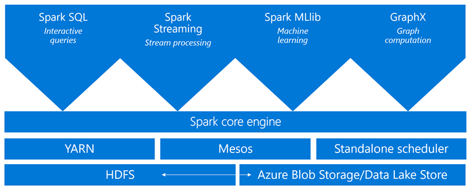

# Spark Scenarios - Build high-speed scalable data pipelines

## What is Apache Spark?

Apache Spark is an open-source processing framework that runs large-scale data analytics applications. Spark is built on an in-memory compute engine, which enables high-performance querying on big data. It takes advantage of a parallel data-processing framework that persists data in-memory and disk if needed. This allows Spark to deliver 100-times faster speed and a common execution model for tasks such as extract, transform, load (ETL), batch, interactive queries and others on data in an Apache Hadoop Distributed File System (HDFS). Azure makes Apache Spark easy and cost effective to deploy with no hardware to buy, no software to configure, a full notebook experience for authoring compelling narratives and integration with partner business intelligence tools.

---
## What are the use cases for Spark on HDInsight?

Spark clusters in HDInsight enable many scenarios.  Below are some common example scenarios.
### 1. Interactive data analysis and BI

Apache Spark in HDInsight stores data in Azure Storage or Azure Data Lake Store. Business experts and key decision makers can analyze and build reports over that data and use Microsoft Power BI to build interactive reports from the analyzed data. Analysts can start from unstructured/semi structured data in cluster storage, define a schema for the data using notebooks, and then build data models using Microsoft Power BI. Spark clusters in HDInsight also support a number of third party BI tools such as Tableau making it an ideal platform for data analysts, business experts, and key decision makers. [Look at a tutorial for this scenario](https://docs.microsoft.com/en-us/azure/hdinsight/hdinsight-apache-spark-use-bi-tools).

### 2. Spark Machine Learning

Apache Spark comes with MLlib, a machine learning library built on top of Spark that you can use from a Spark cluster in HDInsight. Spark cluster on HDInsight also includes Anaconda, a Python distribution with a variety of packages for machine learning. Couple this with a built-in support for Jupyter and Zeppelin notebooks, and you have a top-of-the-line environment for creating machine learning applications. Look at a tutorial for this scenario -- [Predict building temperatures uisng HVAC data.](https://docs.microsoft.com/en-us/azure/hdinsight/hdinsight-apache-spark-ipython-notebook-machine-learning)  Look at a tutorial for this scenario -- [Predict food inspection results.](https://docs.microsoft.com/en-us/azure/hdinsight/hdinsight-apache-spark-machine-learning-mllib-ipython)  

### 3. Spark streaming and real-time data analysis

Spark clusters in HDInsight offer a rich support for building real-time analytics solutions. While Spark already has connectors to ingest data from many sources like Kafka, Flume, Twitter, ZeroMQ, or TCP sockets, Spark in HDInsight adds first-class support for ingesting data from Azure Event Hubs. Event Hubs are the most widely used queuing service on Azure. Having an out-of-the-box support for Event Hubs makes Spark clusters in HDInsight an ideal platform for building real time analytics pipeline. [Look at a tutorial for this scenario.](https://docs.microsoft.com/en-us/azure/hdinsight/hdinsight-apache-spark-eventhub-streaming)

---

## Next steps
In this article, you learned how to use HDFS-compatible Azure storage and process the data it contains with Spark running on HDInsight. This allows you to build scalable, long-term, archiving data acquisition solutions and use HDInsight to unlock the information inside the stored structured and unstructured data.

For more information, see:

* [Introductions to Spark on HDInsight](https://docs.microsoft.com/en-us/azure/hdinsight/hdinsight-apache-spark-overview)
* [Eight scenarios with Apache Spark on Azure](https://blogs.technet.microsoft.com/dataplatforminsider/2016/08/29/eight-scenarios-with-apache-spark-on-azure-that-will-transform-any-business/)
* [Build Apache Spare machine learning applications on Azure HDInsight](https://docs.microsoft.com/en-us/azure/hdinsight/hdinsight-apache-spark-ipython-notebook-machine-learning)
*[Use Spark MlLib to build a machine learning application and analyze a dataset](https://docs.microsoft.com/en-us/azure/hdinsight/hdinsight-apache-spark-machine-learning-mllib-ipython)

