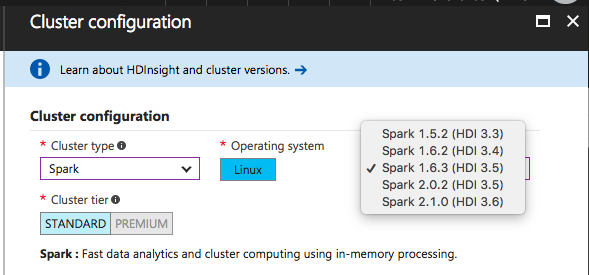
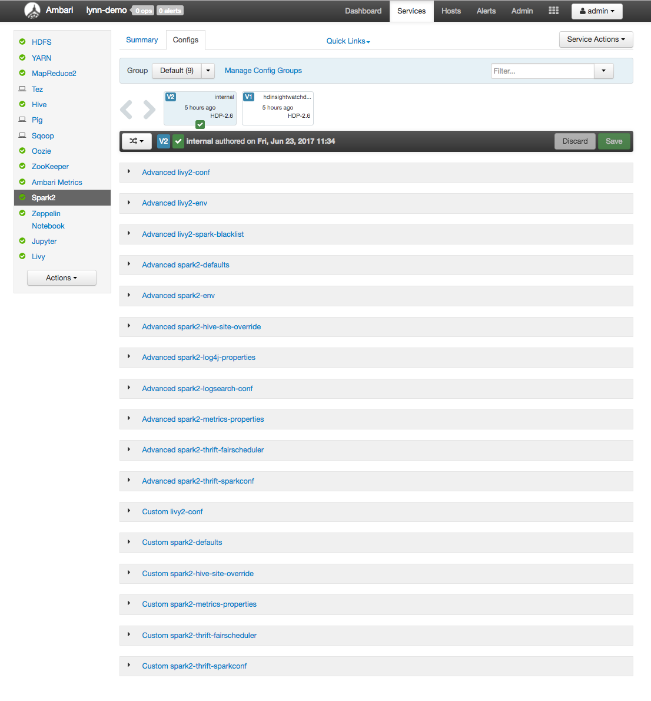
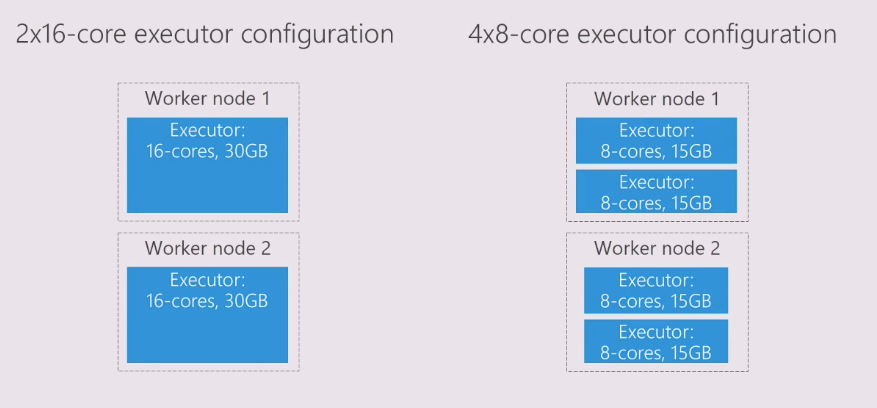

# Configuring Spark Settings

A Spark cluster is an installation of the Apache Spark library onto a HDInsight Hadoop cluster.  Each HDInsight cluster includes default configuration parameters for your Spark cluster at the top level and also at the level of Spark services and service instances in your Spark cluster.  A Spark Job is a set of multiple tasks executed via parallel computation. Spark Jobs are generated in response to a Spark actions (such as 'collect' or 'save').  Spark uses a threadpool of tasks for parallel execution rather than a pool of JVM resources (used by MapReduce).

A key aspect of managing a HDInsight Hadoop cluster is monitoring all jobs on the cluster to make sure they are running in a predictable manner.  This application monitoring includes Apache Spark job monitoring and optimization.   The diagram below shows the core Spark Architecture.  It is important to consider the execution objects when determining how to optimize cluster configuration to best run Spark Jobs.  The objects show in the the diagram are the Driver Program and it's associated Spark Context, the Cluster Manager, and the n-number of Worker Nodes.  Each Worker Node includes it's own Executor, Cache and n-number of Task instances.

## Default Spark HDInsight cluster 

The default HDInsight Apache Spark cluster includes the following: Head node (2), worker node (1+), ZooKeeper node (3) (free for A1 ZooKeeper VM size).  Below is a diagram


#### Which version of Spark?
2.x (plus configuration) has potential to run much better than Spark 1.x. 2.x has a number of new features, such as Tungston, Catalyst Query Optimization and more.  HDInsight includes multiple versions of both Spark and HDInsight itself.  One key cluster configuration consideration is to select the version of Spark that best suits your needs.  When you create an HDInsight Spark cluster, you will be presented with suggested VM sizes for each of the components (D12 v2 or greater as of this writing, which are [Memory-optimized Linux VM sizes](https://docs.microsoft.com/en-us/azure/virtual-machines/linux/sizes-memory) for Azure). Shown below are the Spark versions that you can select from when deploying a new cluster.



TIP: The default version of Apache Spark from the HDInsight service may change without notice. If you have a version dependency, Microsoft recommends that you specify the version when you create clusters using .NET SDK/Azure PowerShell and Azure CLI.

Apache Spark provides three locations to configure the system:
* Spark properties control most application parameters and can be set by using a `SparkConf` object, or through Java system properties.
* Environment variables can be used to set per-machine settings, such as the IP address, through the `conf/spark-env.sh` script on each node.
* Logging can be configured through `log4j.properties`.

When you select a particular version of Spark, your cluster includes a number of default configuration settings.  For whichever version of Spark that you choose, you can change the default Spark configuration values by providing a custom Spark configuration file.  An example is shown below.

```
    spark.hadoop.io.compression.codecs org.apache.hadoop.io.compress.DefaultCodec,org.apache.hadoop.io.compress.GzipCodec
    spark.sql.files.openCostInBytes 1099511627776
    spark.sql.files.maxPartitionBytes 1099511627776
    spark.hadoop.mapreduce.input.fileinputformat.split.minsize 1099511627776
    spark.hadoop.parquet.block.size 1099511627776
```

In the example shown above (taken from a bioinformatics use case), the compression codec, hadoop mapreduce split minimum size and parquet block sizes, as well as the spar sql partition and open file sizes default values are overriden because the associated data and jobs (i.e. genomic data) have particular characteristics which will perform more optimally using these custom configuration settings.

### Components included as part of a Spark Cluster

Spark clusters in HDInsight include the following components that are available on the clusters by default. Each of these components includes default configuration values which can be overridden as business needs dictate.

* Spark Core - Spark Core, Spark SQL, Spark streaming APIs, GraphX, and MLlib
* Anaconda - a python package manager
* Livy - the Apache Spark REST API (used to submit remote jobs to a HDInsight Spark cluster)
* Jupyter and Zepplin notebooks - interactive browser-based UI for interacting with your Spark cluster
* ODBC driver  --  connects Spark clusters in HDInsight from BI tools such as Microsoft Power BI and Tableau

---

#### Spark Config Best Practices

Monitor GC-Overhead - see slides
when you run spark-shell or spark cluster per node -- how many executor-cores, executor-memory, etc.. do you need
see slide - balance based on garbage-collection size

Monitor Exectuor Size
* Start with 30GB per executor and distribute available machine cores
* Increase number of executor-cores for larger clusters ( > 100 executors)
* Decrease size based on trial runs and observed GC-overhead and other factors

< 10% of your task time, GC is flooding, then make your executors BIGGER by..
reduce number of cores and increase number of executors and verify memory

Of course tuning your Spark configuration settings is only one of many techniques you can consider when tuning for improved performance.  
----
## Viewing Cluster Configuration Settings

It is common practice when performing performance optimization on an HDInsight cluster to begin by verifying cluster configuration settings.  To do this for not only your particular Apache Spark configuration, but also other services that you may have installed, you launch the HDInsight Dashboard from the Azure Portal by clicking the 'Dashboard' link on the Spark cluster blade. 

You will be prompted to login with the username and password that you specified when you setup the HDInsight cluster.  After you enter your administrator cluster credentials, then you'll be presented with the Ambari Web UI.  This UI provides a dashboard view of the key cluster resource utilitization metrics.  It also includes a tab for `Config History`.  Here you can quickly jump to configuration information about any installed service, including Spark.

After you click on `Config History`, then click on `Spark2` to see configuration values for Apache Spark.  Next click on the `Configs` tab, then click on the `Spark2` (or `Spark` depending on the version of Spark that you've installed on your cluster) service link in the service list.  

You will be presented with a list of configuration values for your cluster as shown below.



To view Spark configuration values, click the one of the links labeled with the word 'spark' in the link title.  Configurations for Spark include the following both custom and advanced configuration values include these configuration categories:
* Custom Spark2-defaults
* Custom Spark2-metrics-properties
* Advanced Spark2-defaults
* Advanced Spark2-env
* Advanced spark2-hive-site-override

After you click one of these links you can view and also update configuration values.  If you create a non-default set of configuration values, then you can see a history of any configuration updates you've performed in this UI as well.  This configuration history can be helpful if you wish to verify a non-default configuration is in use for performance optimization.

### What is the optimum cluster configuration to run Spark applications?
The three key parameters that can be used for Spark configuration depending on application requirements are `spark.executor.instances`, `spark.executor.cores`, and `spark.executor.memory`. An Executor is a process launched for a Spark application. It runs on the worker node and is responsible to carry out the tasks for the application. The default number of executors and the executor sizes for each cluster is calculated based on the number of worker nodes and the worker node size. These are stored in `spark-defaults.conf `on the cluster head nodes.  Click the link `Custom spark-defaults` to edit these values on a running cluster.  After you make changes, then you'll be prompted in the UI to `Restart` all the affected services.


The three configuration parameters can be configured at the cluster level (for all applications that run on the cluster) or can be specified for each individual application as well.

Note: If you only wish to verify common Spark configuration settings, you can also click on the `Environment` tab on the top level Spark Job UI interface.  In this view, you can view, but not change, cluster configuration values.  

Alternatively, you can use the Ambari REST API to programmatically verify HDInsight and Spark cluster configuation settings.  More information is available via the [GitHub repository Ambari API reference](https://github.com/apache/ambari/blob/trunk/ambari-server/docs/api/v1/index.md).

----
### Spark Cluster Custom Configuration

Depending on your Spark workload, you may determine that a non-default Spark configuration would result in more optimized Spark Job executions.  You should perform benchmark testing with key workloads to validate any non-default cluster configurations.  Some of the common parameters that you may consider adjusting are listed below with associated parameter notes.  Also an example of how you might configure two worker nodes with different node configuration values is shown in the graphic.

* Executors                (--num-executors)
    - set the appropriate number of executors
* Cores for each executor  (--executor-cores)
    - have middle-sized executors, as other processed will consume some portion of the available memory
* Memory for each executor (--executor-memory) 
    - controls heap size on YARN, you'll need to leave some memory for execution overhead



#### To Change Executor Size

To reduce size (often done is response to keep GC-overhead < 10%), reduce head size below 32GB and also reduce cores used.
To increase size (often done to reduce communication between executors), reduce the number of open connections between executors on larger cluster (those with more than 100 executors.  Increase the heap size to accomodate memory-intensive tasks. You could also reduce per-executor memory overhead and oversubscribe the CPU to increase utilization.

For reference key Spark executor memory parameters are shown below. 

* `spark.executor.memory` defines the TOTAL amount of memory available for the executor
* `spark.storage.memoryFraction` (default ~ 60%) defines the amount available for storing persisted RDDs
* `spark.shuffle.memoryFraction` (default ~ 20%) deinfes the amount reserved for shuffle
* `spark.storage.unrollFraction/safetyFraction` (~30% of total memory) - avoid using, this is used internally by Spark

Also of note is that YARN controls the maximum sum of memory used by the containers on each Spark node.  The graphic below shows the key objects and relationship between them.


### Change the parameters for an application running in Jupyter notebook

For applications running in the Jupyter notebook, you can use the `%%configure` command to make configuration changes. Ideally, you must make such changes at the beginning of the application, before you run your first code cell. This ensures that the configuration is applied to the Livy session, when it gets created. If you want to change the configuration at a later stage in the application, you must use the -f parameter. However, by doing so all progress in the application will be lost.

The code below shows how to change the configuration for an application running in a Jupyter notebook.

```
    %%configure
    {"executorMemory": "3072M", "executorCores": 4, "numExecutors":10}
```

-----
## Conclusion

There are a number of core considerations you need to pay attention to make sure your Spark Jobs run in a predictable and performant way.  It's key for you to focus on using the best Spark cluster configuration for your particular workload.  Along with that, you'll need to monitor the execution of long-running and/or high resource consuming Spark Job executions.  The most common challenges center around memory pressure due to improper configurations (particularly wrong-sized executors), long-running operations and tasks which result in cartesian operations.  Using caching judiciously can significantly speed up jobs.  Finally, it's important to adjust for data skew in your job tasks.

## See also

* [What are the Hadoop components and versions available with HDInsight?](https://docs.microsoft.com/en-us/azure/hdinsight/hdinsight-component-versioning)
* [Manage resources for a Spark cluster on HDInsight](https://docs.microsoft.com/en-us/azure/hdinsight/hdinsight-apache-spark-resource-manager)
* [Set up clusters in HDInsight with Hadoop, Spark, Kafka, and more](https://docs.microsoft.com/en-us/azure/hdinsight/hdinsight-hadoop-provision-linux-clusters)
* [Apache Spark Configuration](https://spark.apache.org/docs/latest/configuration.html)
* [Running Spark on YARN](https://spark.apache.org/docs/latest/running-on-yarn.html)


