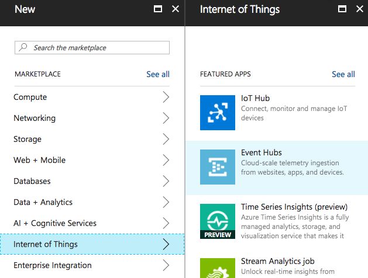
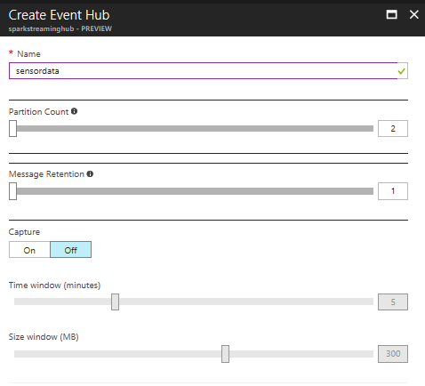
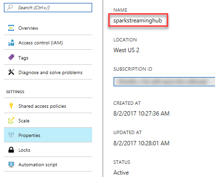
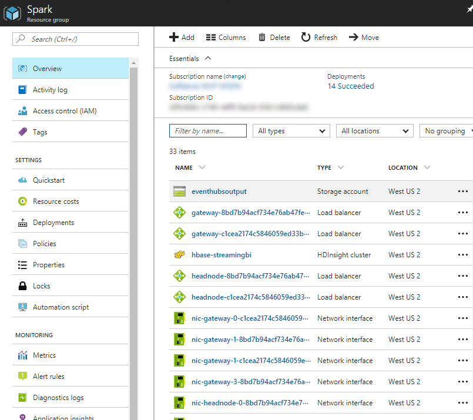

# Streaming and Business Intelligence

In this article you will learn to process real-time telemetry using Spark Structured Streaming. To accomplish this you will perform the following high-level steps:

1. Provision an HDInsight cluster with Spark 2.1.
2. Provision an Event Hubs instance.
3. Compile and run on your local workstation a sample Event Producer application that generates events to send to Event Hubs.
4. Use the [Spark Shell](hdinsight-spark-shell.md) to define and run a simple Spark Structured Streaming application.

## Prerequisites

* An Azure subscription. See [Get Azure free trial](https://azure.microsoft.com/documentation/videos/get-azure-free-trial-for-testing-hadoop-in-hdinsight/).

Make sure you have the following installed on the computer where you run Event Producer application:

* Oracle Java Development kit. You can install it from [here](http://www.oracle.com/technetwork/java/javase/downloads/jdk8-downloads-2133151.html).
* Apache Maven. You can download it from [here](https://maven.apache.org/download.cgi). Instructions to install Maven are available [here](https://maven.apache.org/install.html).


## Provison an Event Hubs namespace 
In this task you will provision the Event Hubs namespace that will ultimately contain your Event Hubs instance.

1. Continue in the [Azure Portal](https://portal.azure.com/).
2. Select + New, Internet of Things, Event Hubs.

    

3. On the Create namespace blade, provide a unique name for your Event Hubs namespace.
4. Leave the Pricing tier at Standard.
5. Choose a Subscription and Resource Group as appropriate.
6. For the Location, choose the same Location as you used for your HDInsight cluster.

    

7. Select Create.

## Provision an Event Hub 
In this task you will provison the Event Hub instance that will receive events from a sample application that generates random events, and that you will use as the source for events to process using Spark Structured Streaming. 

1. Once your Event Hubs namespace has provisioned, navigate to it in the [Azure Portal](https://portal.azure.com/).
2. At the top of the blade, select + Event Hub.

    

3. In the Create Event Hub blade, enter the name "hub1" for your Event Hub.
4. Leave the remaining settings at their defaults. Note that your Event Hub will have 2 partitions (as set in Partition Count). 

    

5. Select Create.
6. On your Event Hubs blade for your namespace, select **Event Hubs**. Select the **sensordata** entry.

7. Select **Shared access policies** from the side menu.

    

7. In the list of Shared Access Policies, click the **+ Add** link to add the following policies:

    | POLICY | CLAIMS |
	| ----- | ----- |
	| spark | Listen |
	| devices | Send |

8. Select both policies and copy the value under Primary Key for both, then paste them into a temporary text file. These values are your Policy Key for each policy. Also, take note that the Policy Names are "devices" and "spark". 

    

9. Close the Policy blade and select Properties from the side menu.

    

10. The value under Name is your namespace, take note of this value along with your Policy Keys and Names. Also, take note that the name of your Event Hub itself is "sensordata".


## Create a Spark and HBase cluster

The steps in this section use an [Azure Resource Manager template](../azure-resource-manager/resource-group-template-deploy.md) to create an Azure Virtual Network and a Spark and HBase cluster on the virtual network.

> [!NOTE]
> A virtual network is used so that the structured streaming app running on the Spark cluster can directly communicate with the HBase cluster using the HBase Java API.

The Resource Manager template used in this document is located in the article's code repo located at (TODO: UPDATE URI HERE AND FOR BUTTON BELOW) **https://raw.githubusercontent.com/ZoinerTejada/hdinsight-docs/master/code/hdinsight-streaming-and-business-intelligence/create-hbase-spark-cluster-in-vnet.json**.

1. Click the following button to sign in to Azure and open the Resource Manager template in the Azure portal.
   
    <a href="https://portal.azure.com/#create/Microsoft.Template/uri/https%3A%2F%2Fraw.githubusercontent.com%2FZoinerTejada%2Fhdinsight-docs%2Fmaster%2Fcode%2Fcreate-hbase-spark-cluster-in-vnet.json" target="_blank"></a>

2. From the **Custom deployment** blade, enter the following values:
   
    
   
   * **Base Cluster Name**: This value is used as the base name for the Spark and HBase clusters. For example, entering **abc** creates a Spark cluster named **spark-abc** and an HBase cluster named **hbase-abc**.
   * **Cluster Login User Name**: The admin user name for the Spark and HBase clusters.
   * **Cluster Login Password**: The admin user password for the Spark and HBase clusters.
   * **SSH User Name**: The SSH user to create for the Spark and HBase clusters.
   * **SSH Password**: The password for the SSH user for the Spark and HBase clusters.
   * **Location**: The region that the clusters are created in.
     
     Click **OK** to save the parameters.

3. Use the **Basics** section to select the Resource Group you used for your Event Hub.
4. Read the terms and conditions, and then select **I agree to the terms and conditions stated above**.
5. Finally, check **Pin to dashboard** and then select **Purchase**. It takes about 20 minutes to create the clusters.

Once the resources have been created, you are redirected to a blade for the resource group that contains the clusters and web dashboard.



> [!IMPORTANT]
> Notice that the names of the HDInsight clusters are **spark-BASENAME** and **hbase-BASENAME**, where BASENAME is the name you provided to the template. You use these names in a later step when connecting to the clusters.


## Download and configure the project

Use the following to download the project from GitHub.

    git clone TODO: ENTER URI TO THE REPO

After the command completes, you have the following directory structure:

    hdinsight-streaming-and-business-intelligence/
        SendAirportTempEvents/ - sends mock airport temperature sensor data to Event Hub.

> [!NOTE]
> This document does not go in to full details of the code included in this sample. However, the code is fully commented.

### Start generating data

1. Open a new command prompt, shell, or terminal, and change directories to **hdinsight-streaming-and-business-intelligence/SendAirportTempEvents/**. To install the dependencies needed by the application, use the following command:
   
        npm install

2. Open the **app.js** file in a text editor and add the Event Hub information you obtained earlier:
   
        // Event Hub Namespace
        var namespace = 'YOUR_NAMESPACE';
        // Event Hub Name
        var hubname ='sensordata';
        // Shared access Policy name and key (from Event Hub configuration)
        var my_key_name = 'devices';
        var my_key = 'YOUR_KEY';
   
   > [!NOTE]
   > This example assumes that you have used **sensordata** as the name of your Event Hub, and **devices** as the name of the policy that has a **Send** claim.

3. Use the following command to insert new entries in Event Hub:
   
        node app.js
   
    You will see several lines of output that contain the data sent to Event Hub:

    ```   
    Sending batch payload:
    [{"Body":"{\"TimeStamp\":\"2017-08-03T02:14:32Z\",\"DeviceId\":\"1\",\"Temperature\":65}"},{"Body":"{\"TimeStamp\":\"2017-08-03T02:14:42Z\",\"DeviceId\":\"1\",\"Temperature\":65}"},{"Body":"{\"TimeStamp\":\"2017-08-03T02:14:52Z\",\"DeviceId\":\"1\",\"Temperature\":65}"},{"Body":"{\"TimeStamp\":\"2017-08-03T02:15:02Z\",\"DeviceId\":\"1\",\"Temperature\":65}"},{"Body":"{\"TimeStamp\":\"2017-08-03T02:15:12Z\",\"DeviceId\":\"1\",\"Temperature\":65}"},{"Body":"{\"TimeStamp\":\"2017-08-03T02:15:22Z\",\"DeviceId\":\"1\",\"Temperature\":65}"},{"Body":"{\"TimeStamp\":\"2017-08-03T02:15:32Z\",\"DeviceId\":\"1\",\"Temperature\":65}"},{"Body":"{\"TimeStamp\":\"2017-08-03T02:15:42Z\",\"DeviceId\":\"1\",\"Temperature\":65}"},{"Body":"{\"TimeStamp\":\"2017-08-03T02:15:52Z\",\"DeviceId\":\"1\",\"Temperature\":65}"},{"Body":"{\"TimeStamp\":\"2017-08-03T02:16:02Z\",\"DeviceId\":\"1\",\"Temperature\":65}"},{"Body":"{\"TimeStamp\":\"2017-08-03T02:16:12Z\",\"DeviceId\":\"1\",\"Temperature\":65}"},{"Body":"{\"TimeStamp\":\"2017-08-03T02:16:22Z\",\"DeviceId\":\"1\",\"Temperature\":65}"},{"Body":"{\"TimeStamp\":\"2017-08-03T02:16:32Z\",\"DeviceId\":\"1\",\"Temperature\":65}"},{"Body":"{\"TimeStamp\":\"2017-08-03T02:16:42Z\",\"DeviceId\":\"1\",\"Temperature\":65}"},
    ...
    ...
    ```

Sample data is loaded one at a time (8,640 total) to simulate a data stream, for a period representing 24 hours of temperature data from an airport terminal. Rooms start at an ambient temperature (65 F), and flights occur every 90 minutes between 6am and 11pm. As people arrive 30 minutes prior to a flight, the temperature starts to rise around 5 degrees, due to warmth from bodies. 30 minutes after the flight arrives, people are boarded, and the temperature starts to drop towards ambient temperature.

If you wish to batch load the data to quickly insert the same amount of data 500 events at a time, execute the app using the `-batch` argument (`node app.js -batch`).

## Next steps

In this article, we covered the steps necessary to upgrade an HBase cluster. Learn more about HBase and upgrading HDInsight clusters by following the links below:

* Learn how to [upgrade other HDInsight cluster types](hdinsight-upgrade-cluster.md)
* Learn more about [connecting to and using Ambari](hdinsight-hadoop-manage-ambari.md) to manage your clusters
* Read in-depth information about [changing Ambari configs](hdinsight-changing-configs-via-ambari.md#hbase-optimization-with-the-ambari-web-ui), including settings to optimize your HBase and other HDInsight clusters
* Learn about the [various Hadoop components available with HDInsight](hdinsight-component-versioning.md)