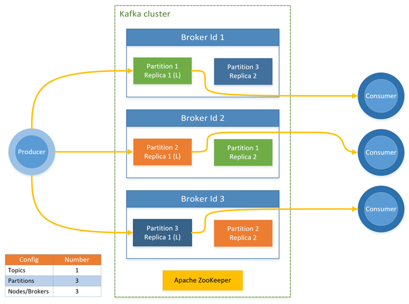
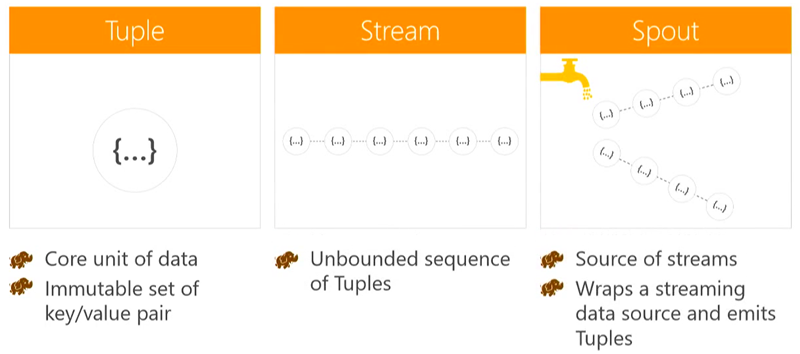
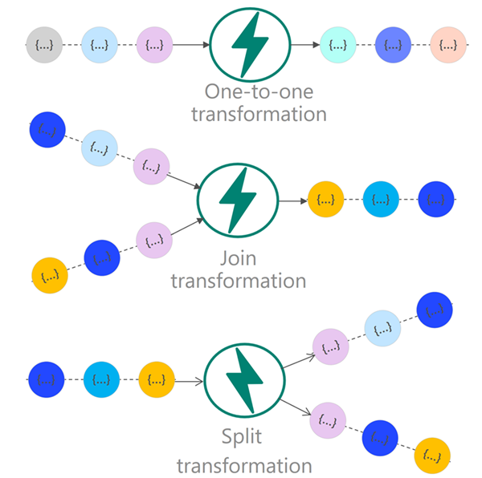

# Streaming at Scale

Many of today's Big Data solutions must act on data in motion at any given point in time. In other words, realtime streaming data. In most cases, this data is most valuable at its time of arrival, such as stock market data, anomaly data used for fraud detection, social networking information that detects trending topics, etc. These applications require transparently scaling their computation models to large clusters, ensuring that valuable information isn't lost when huge spikes of streaming data come rushing in. Being able to quickly scale your solution by adding nodes on demand can be the difference between missing out on incoming information and making a key decision.

To ease the process of scaling streaming platforms, such as Kafka, Apache Storm, or Spark Streaming, HDInsight offers an elegant scale model without the need to throttle your resources. Unlike running one of these streaming platforms on-premises, HDInsight does not require you to have intimate knowledge of scaling a cluster without disrupting any currently running pipelines. All of the necessary steps are handled for you when scaling is performed through the HDInsight utilities.

## What does a streaming architecture look like?

From a very high level, you have one or more data sources generating events (sometimes in the millions per second) that need to be ingested very quickly to avoid dropping any useful information. This is handled by the Stream Buffering, or event queuing, layer by a service such as [Kafka]() or [Event Hubs](). Once you collect your events, you can then analyze the data using any real-time analytics system within the Stream Processing layer, such as [Storm](), [Spark Streaming](), [Azure Stream Analytics](), or similar. This processed data can be stored in long-term storage systems, like [Azure Data Lake Store](), or displayed in real-time on a [Power BI]() dashboard or custom web page. 

When using Kafka as your ingest service, your options for stream processing are Spark and Storm.

Use the following button to deploy a new Azure virtual network, Kafka, and **Spark** clusters to your Azure subscription:

Alternately, deploy a new Azure virtual network with Kafka and **Storm** clusters:

There are other options when designing your streaming architecture by incorporating other Azure services that are not necessarily part of the HDInsight platform. The following diagram illustrates using [Event Hubs]() for ingest, while opening up additional processors, such as [Stream Analytics](), [EventProcessor Host](), [Service Fabric](), and [Azure Functions](). The rest of the article will focus on scaling with Kafka and Storm or Spark Streaming.

## What is Kafka?

Kafka provides high throughput, low-latency message queueing service, originally developed at LinkedIn, and is now part of the Apache suite of Open Source Software (OSS). It uses a publish and subscribe messaging model and stores streams of partitioned data safely in a distributed, replicated cluster. When needed, it scales linearly as throughput increases.

The diagram above shows a typical Kafka configuration that uses consumer groups, partitioning, and replication to offer parallel reading of events, as well as fault tolerance. Apache Zookeeper is built for concurrent, resilient, and low-latency transactions, managing state in the Kafka cluster. Each broker is a node within the cluster. A partition is created per consumer, allowing parallel processing of the streaming data. Replication is employed to spread the partitions across nodes, protecting against node (broker) outages. A partition denoted with an *(L)* is the leader for the given partition. Producer traffic is routed to the leader of each node, per state managed by Zookeeper.

There are several advantages to deploying Kafka on HDInsight. Kafka can use customized run actions within Azure Operations Management Suite, providing an automated way to scale clusters as certain capacity limits are reached. Also, a replica rebalancing tool can be used to automatically rebalance the replicas after scaling or applying updates. HDInsight is the only provider in the industry to host a managed Kafka environment, while providing a 99.9% uptime SLA. **NEED MORE INFORMATION:** HDInsight also uses a two-dimensional matrix for implementing rack awareness by way of an update domain, and fault domain, as opposed to using a single dimensional unit. The update domain is a set of machines that will be updated at any given time when you roll out an update. A fault domain is a set of machines attached to a single pod. If network connectivity breaks on that pod, for instance, each of the machines on that pod will fail. This provides a single point of failure within your cluster.

## Apache Storm

Apache Storm is one of the stream processing engines we displayed in the first and second diagram at the top of this article. In summary, it is a distributed, fault-tolerant, open-source computation system that is optimized for processing streams of data in real time with Hadoop. The core unit of data for an event is in the form of a Tuple, which is an immutable set of key/value pairs. An unbounded sequence of these Tuples form a Stream, which is provided by a Spout. The Spout wraps a streaming data source (such as Kafka), and emits Tuples. A storm Topology is a sequence of transformations on these streams. A bolt implements one transformation.

All processing in topologies is done in bolts. Bolts can do anything from filtering, functions, aggregations, joines, talking to databases, and more. Bolts can do simple stream transformations. Doing complex stream transformations often requires multiple steps and thus, multiple bolts. As you can see in the diagram below, a bolt receives a stream of events from other bolts or spouts, and transforms it to emit an output stream. They are able to join multiple input streams, or split a single stream into multiple output streams. During execution, bolts can store or read state from a database or any state stored in the ZooKeeper node.

Storm offers several different levels of guaranteed message processing, including best effort, at least once, and exactly once through Trident. It guarantees every tuple will be fully processed. One of Storm's core mechanisms is the ability to track the lineage of a tuple as it makes its way through the topology in an extremely efficient way. Storm's basic abstractions provide an at-least-once processing guarantee, the same guarantee you get when using a queueing system. Messages are only replayed when there are failures.
Using Trident, which is an even higher level abstraction over Storm's basic abstractions, you can achieve exactly-once processing semantics.

## Spark Streaming

## Scale

HDInsight clusters can be dynamically scaled by adding or removing worker nodes. This operation can be performed while processing data.

> [!IMPORTANT]
> To take advantage of new nodes added through scaling, you need to rebalance Storm topologies started before the cluster size was increased.

## Next steps

Learn more about real-time analytics solutions with Storm on HDInsight:

* [Get started with Apache Storm on HDInsight][gettingstarted]
* [Example topologies for Apache Storm on HDInsight](hdinsight-storm-example-topology.md)

[stormtrident]: https://storm.apache.org/documentation/Trident-API-Overview.html
[samoa]: http://yahooeng.tumblr.com/post/65453012905/introducing-samoa-an-open-source-platform-for-mining
[apachetutorial]: https://storm.apache.org/documentation/Tutorial.html
[gettingstarted]: hdinsight-apache-storm-tutorial-get-started-linux.md