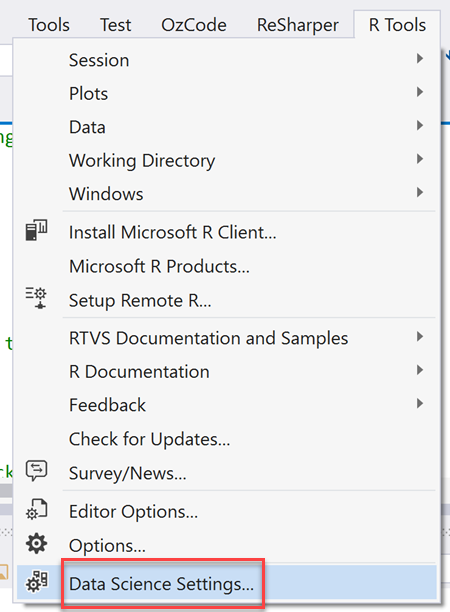
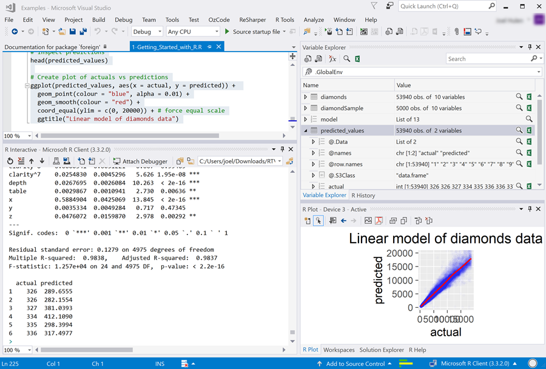
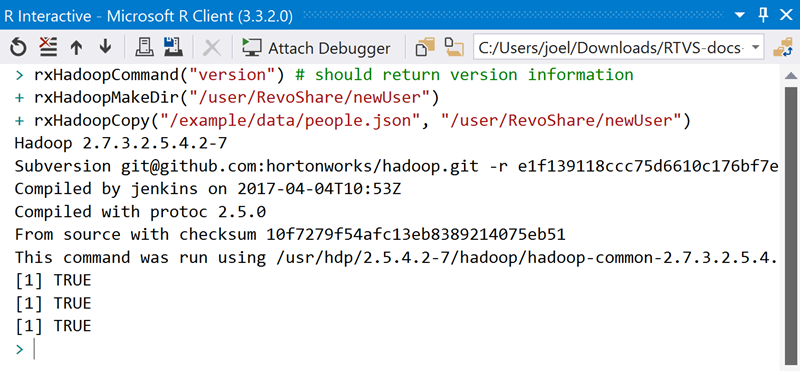
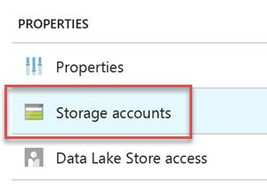
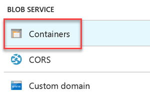
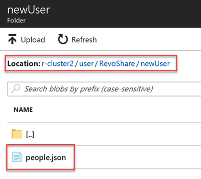

# Submit Jobs from R Tools for Visual Studio

## Overview

[R Tools for Visual Studio](https://www.visualstudio.com/vs/rtvs/) (RTVS) is a free, open-source extension for the Community (free), Professional, and Enterprise editions of both [Visual Studio 2017](https://www.visualstudio.com/downloads/), as well as [Visual Studio 2015 Update 3](http://go.microsoft.com/fwlink/?LinkId=691129) or higher. Most of the critical features of RStudio are included in RTVS, with more being added as the tool matures. If there is a missing feature that you'd like included in RTVS, consider filling out the [RTVS survey](https://www.surveymonkey.com/r/RTVS1).

RTVS enhances your R workflow by offering tools such as the [R Interactive window](https://docs.microsoft.com/visualstudio/rtvs/interactive-repl) (REPL), intellisense (code completion), [plot visualization](https://docs.microsoft.com/visualstudio/rtvs/visualizing-data) through R libraries such as ggplot2 and ggviz, [R code debugging](https://docs.microsoft.com/visualstudio/rtvs/debugging), and more.

## Setting up your environment

To get started, [**install R Tools for Visual Studio**](https://docs.microsoft.com/visualstudio/rtvs/installation).


When installing the tools for Visual Studio 2017, make sure you select the **R language support**, **Runtime support for R development**, and **Microsoft R Client** options after selecting the *Data science and analytical applications* workload.

You will need to have public and private keys set up to [use SSH with HDInsight](hdinsight-hadoop-linux-use-ssh-windows) for authentication.

To run the `RevoScaleR` and `RxSpark` functions, you will need to [install R Server](https://msdn.microsoft.com/microsoft-r/rserver-install-windows) on your machine.

To create a compute context that runs [`RevoScaleR`](https://msdn.microsoft.com/microsoft-r/scaler/scaler) functions from your local client to your HDInsight cluster, you will need to install [PuTTY](http://www.putty.org/).

If you desire, apply the Data Science Settings to your Visual Studio environment, which provides a new layout for your workspace that makes it easier to work with the R tools. You do this by going to the new **R Tools** menu item, then selecting **Data Science Settings...**



> To revert to other Visual Studio settings later on, first use the **Tools > Import and Export Settings** command, selecting **Export selected environment settings**, and specifying a file name. To restore those settings, use the same command and select **Import selected environment settings**. You can also use the same commands if you change the data scientist layout and want to return to it later on, rather than using the **Data Science Settings** command directly.

## Execute local R methods

Once you have [provisioned your R Server HDInsight cluster](hdinsight-hadoop-r-server-get-started) and installed the [RTVS extension](https://docs.microsoft.com/visualstudio/rtvs/installation), download the [samples zip file](https://github.com/Microsoft/RTVS-docs/archive/master.zip) to get started.

1. Open `examples/Examples.sln`, to launch the solution in Visual Studio.
2. Open the `1-Getting Started with R.R` file underneath the `A first look at R` solution folder.
3. Starting at the top of the file, press Ctrl+Enter to send each line, one at a time, to the R Interactive window which will display the results. Some lines might take a while as they install packages. Alternatively, you can select all lines in the R file (Ctrl+A), then execute all (Ctrl+Enter), or click the Execute Interactive icon on the toolbar: 

After running all of the lines in the script, you should have an output similar to this:



## Submitting jobs to the HDInsight R cluster

Since you are running Microsoft R Server/Microsoft R Client from a Windows computer equipped with PuTTY, you can create a compute context that will run distributed `RevoScaleR` functions from your local client to your HDInsight cluster. To do this, we need to use `RxSpark` to create the compute context, specifying our username, the Hadoop cluster's edge node, ssh switches, etc.

1. To find your edge node's host name, open your HDInsight R cluster blade on Azure, then select **Secure Shell (SSH)** on the top menu of the Overview pane.


2. Copy the **Edge node host name** value.


3. Paste the following code into the R Interactive window in Visual Studio, altering the values of the setup variables to match your environment:

```R
# Setup variables that connect the compute context to your HDInsight cluster
mySshHostname <- 'r-cluster-ed-ssh.azurehdinsight.net ' # HDI secure shell hostname
mySshUsername <- 'sshuser' # HDI SSH username
mySshClientDir <- "C:\\Program Files (x86)\\PuTTY"
mySshSwitches <- '-i C:\\Users\\azureuser\\r.ppk' # Path to your private ssh key
myHdfsShareDir <- paste("/user/RevoShare", mySshUsername, sep = "/")
myShareDir <- paste("/var/RevoShare", mySshUsername, sep = "/")
mySshProfileScript <- "/usr/lib64/microsoft-r/3.3/hadoop/RevoHadoopEnvVars.site"

# Create the Spark Cluster compute context
mySparkCluster <- RxSpark(
  sshUsername = mySshUsername,
  sshHostname = mySshHostname,
  sshSwitches = mySshSwitches,
  sshProfileScript = mySshProfileScript,
  consoleOutput = TRUE,
  hdfsShareDir = myHdfsShareDir,
  shareDir = myShareDir,
  sshClientDir = mySshClientDir
)

# Set the current compute context as the Spark compute context defined above
rxSetComputeContext(mySparkCluster)
```


4. Now that the compute context has been set to your cluster, execute the following commands in the R Interactive window:

```R
rxHadoopCommand("version") # should return version information
rxHadoopMakeDir("/user/RevoShare/newUser") # creates a new folder in your storage account
rxHadoopCopy("/example/data/people.json", "/user/RevoShare/newUser") # copies file to new folder
```

The above commands should produce an output similar to the following:



After running the `rxHadoopCopy` command that copies the `people.json` file from the example data folder to our newly created `/user/RevoShare/newUser` folder, let's browse to that location to make sure the file copy command was successful.

1. From your HDInsight R cluster blade in Azure, select **Storage accounts** from the left-hand menu.



2. Select the default storage account for your cluster, making note of the container/directory name.

3. Select **Containers** from the left-hand menu on your storage account blade.



4. Select your cluster's container name, browse to the **user** folder (you might have to click *Load more* at the bottom of the list), then select *RevoShare*, then **newUser**. The `people.json` file should be displayed in the `newUser` folder.




## See also

* Some overview link

### Scenarios


