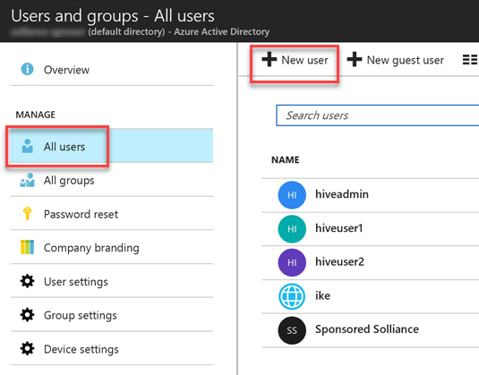
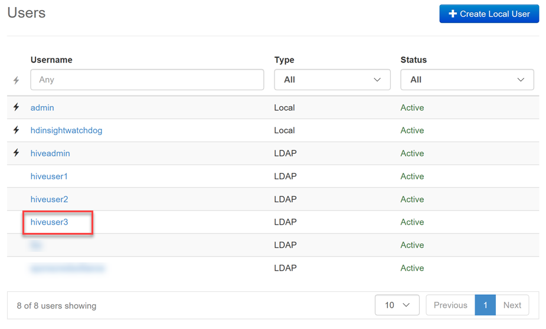

# Sync Other Users from Azure AD to Cluster

When you [provision a domain-joined HDInsight cluster](hdinsight-domain-joined-configure), you are able to take advantage of strong authentication with Azure Active Directory (Azure AD) users, as well as use role-based access control (RBAC) policies. As you add more users and groups to Azure AD, you will need to synchronize those users who you want to have access to your cluster.


## Provision a domain-joined HDInsight cluster

If you have not already done so, follow [these instructions](hdinsight-domain-joined-configure) to provision a new domain-joined cluster.


## Add new Azure AD user(s)

Since each node will need to be updated (as you see fit) with the new unattended upgrade settings, open the Ambari Web UI to view your hosts.

1. From the Azure Portal (portal.azure.com), navigate to the Azure Active Directory directory associated with your domain-joined cluster.

2. Select **All users** from the left-hand menu, then select **New user** from the All users blade.



3. Complete the new user form. Select groups you created for assigning cluster-based permissions. In our example, we created a group named "HiveUsers", to which we will assign our new users. If you followed the [step-by-step instructions](hdinsight-domain-joined-configure) for provisioning your domain-joined cluster, you will have added two groups: "HiveUsers" and "AAD DC Administrators".


4. Click **Create**.


## Use the Ambari REST API to synchronize users

We will be POSTing to the Ambari REST API, following the instructions found [here](hdinsight-hadoop-manage-ambari-rest-api).

1. Connect to your cluster [with SSH](hdinsight-hadoop-linux-use-ssh-unix). From the overview blade for your cluster in the Azure portal, select the **Secure Shell (SSH)** button.


2. Copy the `ssh` command and paste into your SSH client. Enter the ssh user password when prompted.

3. After authenticating, enter the following command, replacing the `<YOUR PASSWORD>` and `<YOUR CLUSTER NAME>` values:

```bash
curl -u admin:<YOUR PASSWORD> -sS -H "X-Requested-By: ambari" \
-X POST -d '{"Event": {"specs": [{"principal_type": "groups", "sync_type": "existing"}]}}' \
"https://<YOUR CLUSTER NAME>.azurehdinsight.net/api/v1/ldap_sync_events"
```

You will receive a response similar to:

```bash
{
  "resources" : [
    {
      "href" : "http://hn0-hadoop.<YOUR DOMAIN>.com:8080/api/v1/ldap_sync_events/1",
      "Event" : {
        "id" : 1
      }
    }
  ]
}
```

To see the status of the synchronization, execute a new `curl` command, using the `href` value returned from the previous command, replacing the `<YOUR PASSWORD>` and `<YOUR DOMAIN>` values:

```bash
curl -u admin:<YOUR PASSWORD> http://hn0-hadoop.<YOUR DOMAIN>.com:8080/api/v1/ldap_sync_events/1
```

You should see an output with the status similar to:

```bash
{
  "href" : "http://hn0-hadoop.YOURDOMAIN.com:8080/api/v1/ldap_sync_events/1",
  "Event" : {
    "id" : 1,
    "specs" : [
      {
        "sync_type" : "existing",
        "principal_type" : "groups"
      }
    ],
    "status" : "COMPLETE",
    "status_detail" : "Completed LDAP sync.",
    "summary" : {
      "groups" : {
        "created" : 0,
        "removed" : 0,
        "updated" : 0
      },
      "memberships" : {
        "created" : 1,
        "removed" : 0
      },
      "users" : {
        "created" : 1,
        "removed" : 0,
        "skipped" : 0,
        "updated" : 0
      }
    },
    "sync_time" : {
      "end" : 1497994072182,
      "start" : 1497994071100
    }
  }
}
```

From our result, we can see that the status is **COMPLETE**, and one new user was created, and the user was assigned a membership. This means that the user was assigned to the synchronized LDAP group (HiveUsers in this example) in Ambari, since the user was added to the same group in Azure AD.

> Please note, only the Azure AD groups that were specified in the **Access user group** property of the Domain settings during cluster creation will be synchronized using this method. Please see the [Create HDInsight cluster](hdinsight-domain-joined-configure#create-hdinsight-cluster) section of the [Configure Domain-joined HDInsight clusters](hdinsight-domain-joined-configure) article for reference.


## Verify that the new Azure AD user was added

Open the [Ambari Web UI](hdinsight-hadoop-manage-ambari) to verify that the new Azure AD user was added. You can access the Ambari Web UI by browsing to **`https://<YOUR CLUSTER NAME>.azurehdinsight.net`**, substituting `<YOUR CLUSTER NAME>`. Enter your cluster administrator username and password that you defined when creating your cluster, when prompted.

1. From the Ambari dashboard, select **Manage Ambari** underneath the **admin** menu.


2. Select **Users** underneath the *User + Group Management* menu group on the left-hand side of the page.


3. You should see your new user listed within the Users table. Note that the Type is set to LDAP, instead of Local.




## Next steps

This article focused on the steps required to synchronize users from your Azure AD tenant to your HDInsight cluster. Use the links below to learn more about domain-joined HDInsight and assigning your new users to Hive policies.

* [Configure Hive policies in Domain-joined HDInsight](hdinsight-domain-joined-run-hive)
* [Manage Domain-joined HDInsight clusters](hdinsight-domain-joined-manage)
